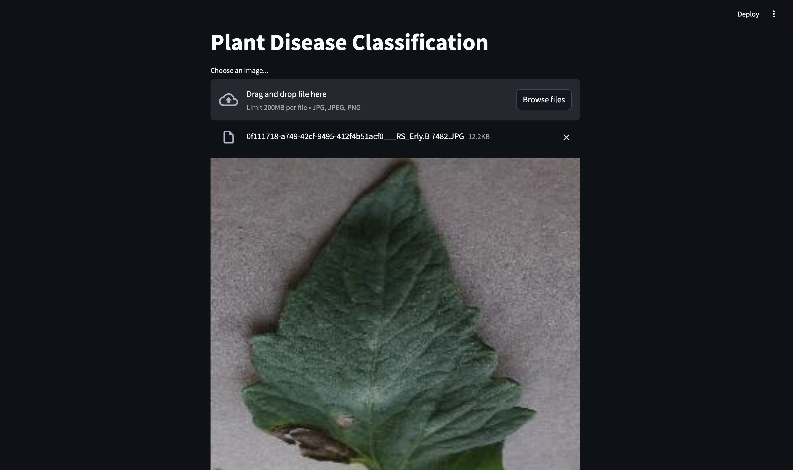
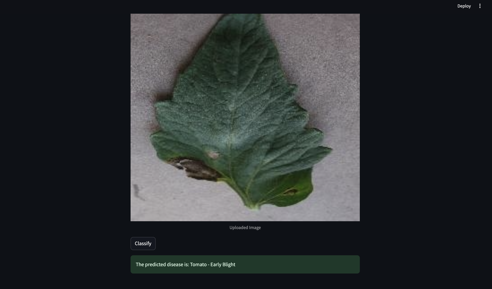

# My Streamlit Plant Disease Classification App

This app classifies plant diseases based on leaf images.

## Screenshots

### Home Page

### Classification Result

## How to Use

1. Upload an image of a plant leaf
2. Click the 'Classify' button
3. You get the predicted class
